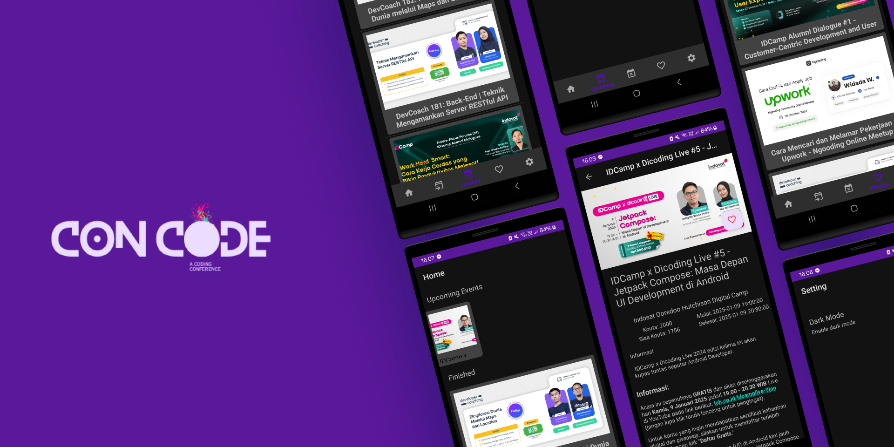

## Overview 📃

Welcome to Concode, A modern and elegant Android application to explore coding events, built as a submission for the Dicoding course. This project implements features like a Bottom Navigation, API integration, local database storage, and a persistent dark mode.

## Features 🚀

- **Explore Events**: Fetch and display active and finished events from Dicoding's API.
- **Event Details**: View detailed information about each event.
- **Favorite Events**: Save favorite events to a local database using Room for offline access.
- **Dark Mode**: Toggle dark mode, with settings saved using DataStore to persist even after closing the app.
- **Bottom Navigation**: Navigate seamlessly between Home, Favorite, and Settings screens.

## Installation 🛠️

**Cloned the repository**:
```bash
   git clone https://github.com/Fhanafii/concode.git
```

## Support 🤔

For any issues or questions, feel free to reach out to me or refer to the comments within the code for guidance.

## Contributing ✨

I welcome contributions! to make this App more better
